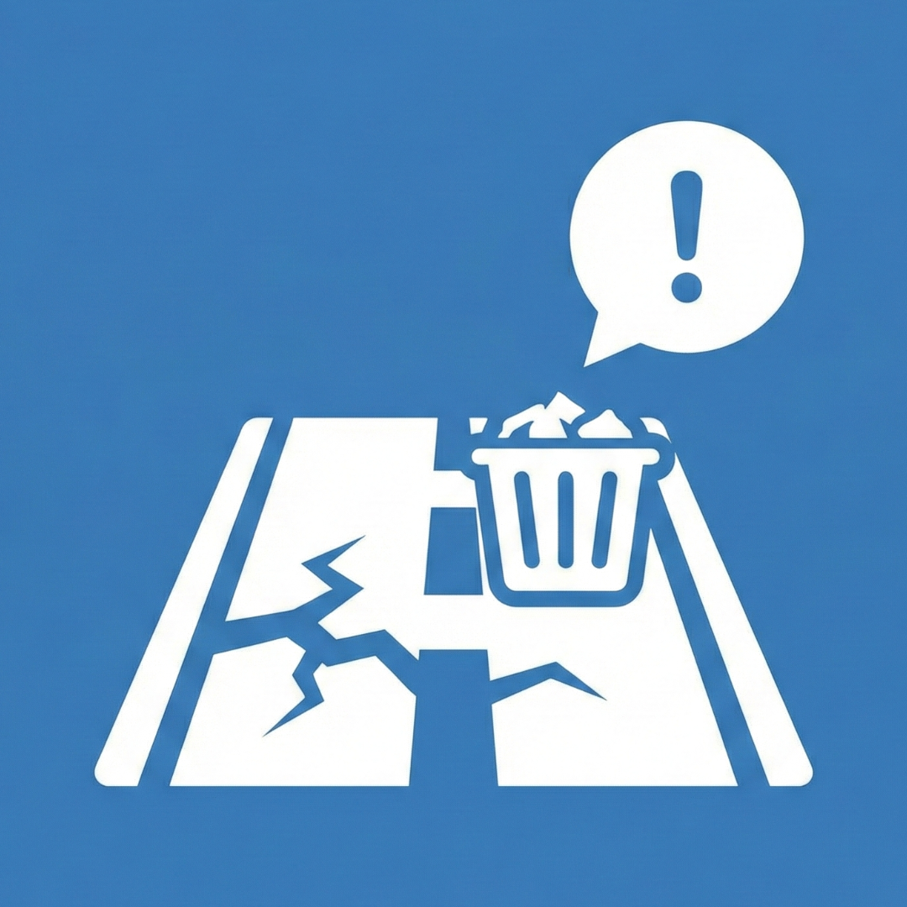

# Municipal Connect - Smart City Governance Platform

  

## 🚀 Status: Active Development
**Municipal Connect** is a production-grade civic technology platform built with **React Native (Expo)** and **Supabase**. We are actively migrating from a standalone MVP to a scalable, real-time distributed system designed to bridge the gap between citizens and municipal authorities.

The goal is to create a seamless, transparent, and efficient issue resolution lifecycle using reactive databases and geospatial technology.

## 🛠️ Tech Stack

  
  
  
  
  
  
  
  

* **Frontend:** React Native with Expo (Managed Workflow)
* **Language:** TypeScript
* **Navigation:** Expo Router (File-based Routing)
* **Backend/Database:** Supabase (PostgreSQL & Realtime Edge Functions)
* **Authentication:** Supabase Auth (OTP, Phone, & Role-based Access)
* **Real-time & Notifications:**
    * **FCM (Firebase Cloud Messaging):** For high-priority emergency alerts.
    * **Supabase Realtime:** For live complaint status updates.
* **Maps:** React Native Maps (Google/Mapbox integration)
* **Storage:** Supabase Storage (Evidence Photos/Videos)

---

## ⚙️ Core Functions & Modules

### 🏙️ Citizen Portal (The Reporter)
* **Smart Reporting Engine:**
    * **AI-Assisted Classification:** Auto-categorization of issues (Pot-holes, Garbage, Water Leakage) using image recognition (Future Scope).
    * **Rich Evidence:** Capture photos, record voice notes, or upload videos directly to Supabase Storage.
    * **Geospatial Tagging:** Auto-detection of Ward Number and precise GPS coordinates using device location services.
* **Real-Time Transparency:**
    * **Live Status Timeline:** Watch the complaint move from "Submitted" → "Assigned" → "In Progress" → "Resolved" in real-time.
    * **Community Feed:** Upvote and comment on nearby issues to prioritize community needs (Crowdsourcing priority).

### 👷 Workforce Dashboard (The Solver)
* **Field Operations:**
    * **Task Dispatch:** Instant notification of new assignments via FCM with priority labels (SLA countdowns).
    * **Navigation Support:** In-app routing to the complaint location using map integration.
* **Proof of Work:**
    * **Geo-Fenced Check-ins:** Employees must be physically present at the location to mark "In Progress."
    * **Resolution Evidence:** Mandatory "Before & After" photo uploads to close a ticket.

### 🏛️ Administration & Analytics (The Overseer)
* **Command Center:**
    * **Heatmap Visualization:** Real-time rendering of problem clusters across city wards to identify infrastructure failures.
    * **Staff Management:** Monitor employee workload, attendance, and resolution efficiency rates.
* **Data-Driven Insights:**
    * **Predictive Analytics:** Charts identifying recurring issues in specific zones.
    * **SLA Monitoring:** Automated alerts for overdue complaints.

### 🔔 Engagement & Alerts (Shared)
* **Hyper-Local Alerts:**
    * Push notifications for scheduled power cuts, water maintenance, or local emergencies in specific wards.
* **Gamification:**
    * **Civic Leaderboards:** Points and badges for active citizens ("Guardian of the Ward") and high-performing officers.

---

## 🎯 Next Goals (Roadmap)
- [ ] **Offline Mode:** Implement `WatermelonDB` for field workers to operate in low-network zones.
- [ ] **IoT Integration:** Connect with Smart City sensors (e.g., Smart Dustbins) for auto-complaint generation.
- [ ] **Multilingual Voice Bot:** AI-powered voice interface for reporting issues in regional dialects.
- [ ] **Blockchain Ledger:** Immutable record-keeping for tender allocations and repair history.

---

### 📂 View Latest Progress
This branch focuses on the implementation of backend logic, Supabase Realtime integration, and functional components. To view the stable version or contribute:

👉 **Check the [Main Branch](https://github.com/abhinav28birajdar/Municipal_Corporation_complaint_app/tree/master)**

---

### 🔗 Quick Links

* [**View Main Branch Code**](https://github.com/abhinav28birajdar/Municipal_Corporation_complaint_app/tree/master)
* [**Report a Bug**](https://github.com/abhinav28birajdar/Municipal_Corporation_complaint_app/issues)
* [**Request a Feature**](https://github.com/abhinav28birajdar/Municipal_Corporation_complaint_app/issues)

 

Empowering Citizens, Improving Cities. ❤️
